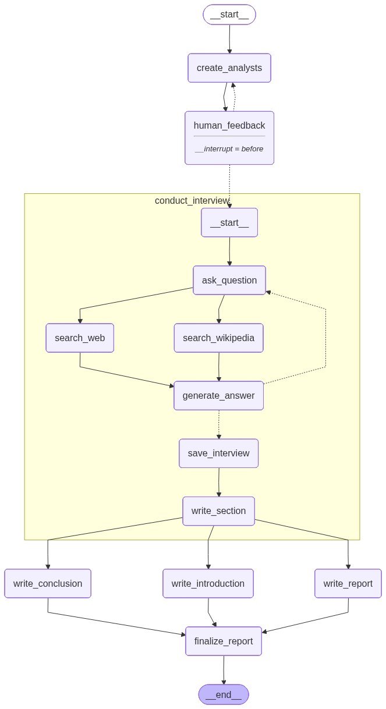
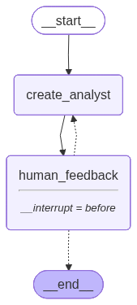
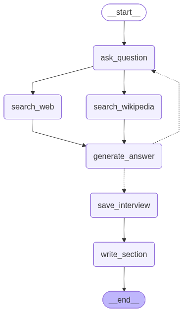
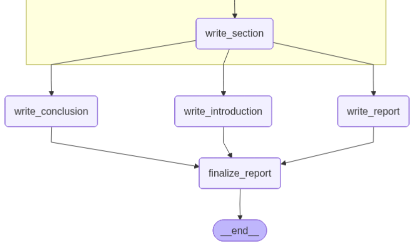

# Multi-Agent System for Research Analysis and Automated Report Generation

## Overview

* This system is designed to perform comprehensive research on any given topic using multiple AI-driven agents. After gathering information, it analyzes the collected data and generates a structured, high-quality response. The final output is delivered as both PDF and DOCX reports.

### What It Does

* **Creates AI Analyst Personas:** Automatically generates specialized AI analyst profiles tailored to the research topic.

* **Conducts Automated Research:** Each analyst performs targeted web searches and collects relevant information.

* **Interviews Experts:** Simulates expert interviews to extract detailed insights.

* **Generates Structured Reports:** Compiles all findings into well-organized reports, including an introduction, detailed sections, a conclusion, and a list of sources.

* **Human-in-the-Loop Refinement:** Incorporates user feedback to refine analyst perspectives and improve report quality.

* **Produces Multi-format Output:** Exports the final reports in both DOCX and PDF formats for easy sharing and printing.

## UseCases

**A. Pharma Domain 🧪**

* Supports drug discovery and pharmaceutical research with automated data gathering, insight extraction, and report generation.

* Enables full research workflows — literature review → analysis → structured report creation.

* Identifies potential drug targets, compares clinical trial data, and summarizes medical papers.

* Generates regulatory-style documentation for internal review.

**B. Finance Domain 💹**

* Conducts market research by collecting financial data, analyzing trends, and generating comprehensive reports.

* Summarizes analyst opinions, forecasts market behavior, and extracts insights from financial news.

* Creates portfolio risk assessments and competitor analysis reports.

* Automates due diligence document creation for investors.

**C. Technology & Software Engineering 💻**

* Performs technical research on frameworks, libraries, and architectures.

* Generates system design documents, technical comparison reports, and best-practice guides.

* Creates API documentation, onboarding guides, and code explanations.

### Workflow

* Let's breakdown this workflow into 3workflows.

**a. Workflow1: 🧩Analyst Creation With Human Feedback Loop**

* This workflow represents the process of creating an AI analyst and integrating human feedback before finalizing the result.

**1. Start Node (__start__)**

* The workflow begins here.
* This node indicates the initiation of the process, where no actions have been taken yet.

**2. Create Analyst (create_analyst)**

* This step is responsible for generating an AI analyst persona based on the topic, domain, or user inputs.
* The system performs initial reasoning to form the analyst’s:
    *  topic: str #research topic
    *  max_analysts: int # number of analyst
    *  human_analyst_feedback: str # Human feedback
    *  analysts: List[Analyst] # Analyst asking questions

**3. Human Feedback (human_feedback)**

* This stage introduces a human-in-the-loop mechanism.

**Purpose:**

* To give users the chance to:
    * Refine the analyst’s role or perspective
    * Adjust tone, expertise, or reasoning style
    * Add constraints or preferences

**End Node (__end__)**
* After the feedback is accepted and the analyst is finalized, the workflow reaches the end.

**B. Workflow2 : 🧩Expert Interview & Content Generation Pipeline**

* This workflow represents the automated process your system uses to ask questions, gather information, generate expert-like answers, and convert them into structured report sections.

### 1. Ask Question (ask_question)

* This Node will ask the Question which is the Analyst. Analyst will ask the que.
### 2. Information Retrieval

* After the question is formulated, the workflow branches into two possible research paths:

**🔍 A. Search Web (search_web)**

* The system performs automated web searches to gather real-time information.

**📚 B. Search Wikipedia (search_wikipedia)**

* The system retrieves structured knowledge from Wikipedia for foundational or background information.

Both paths feed into the answer generation stage.

### 3. Generate Answer (generate_answer)

* From search web and search wikipedia we will get the answers from both places. This generated answer will go to **route_message** method which will check 2 things.
    * a. If there is a "Thank You" which means we are done with answer generation then we will stop the process.
    * b. If my max turn will be complete in this case also we will teriminate the process. If terminated we will pass to save_interview. 
    * If my above 2 conditions are not satisfied again it will goto ask_question

### 4. Save Interview (save_interview)

* The generated answer is stored in the system’s interview log.

### 5. Write Section (write_section)

* Using the saved answer(s), the system writes a structured part of the final report.

* This may include:
    * Paragraphs

    * Subsections

    * Bullet points

    * Explanations or summaries

    * It transforms interview data into polished, readable content.

**C. Workflow3 : 📝Report Composition & Finalization Pipeline**

* This workflow represents the final stage of the system, where all previously generated insights, interviews, and analysis are transformed into a complete, polished research report.

**1. Write Section (write_section)**

* This step generates the main content sections of the report

    * Each section may include:

    * Topic explanations

    * Analysis summaries

    * Expert insights from earlier interviews

    * Subsections and bullet points

This forms the core body of the research document.

**2. Write Conclusion (write_conclusion)**

* After the main sections are completed, the system generates a conclusion that:

    * Summarizes key findings

    * Highlights insights derived from research

    * Provides final thoughts or recommendations

This ensures the report ends with a clear and concise wrap-up.

**3. Write Introduction (write_introduction)**

* Parallel to the conclusion, the system also creates the introduction.

* The introduction includes:

    * Background information

    * Problem statement or objective

    * Scope of the research

    * Structure of the report

It prepares the reader for what the report will cover.

**4. Write Report (write_report)**

* This step compiles or formats all generated content into a structured document.
* This may include:

    * Section ordering

    * Page structuring

    * Formatting guidelines

    * Report metadata (title, authors, etc.)

It ensures the final report follows a consistent layout and style.

**5. Finalize Report (finalize_report)**

* In this step, all components — introduction, sections, and conclusion — are merged to create one unified document.

* The system performs:

    * Content consolidation

    * Formatting corrections

    * Source list insertion

    * Cleanup of spacing, formatting, or inconsistencies

    * Preparation for export (PDF/DOCX)

This step produces the official final report.

## Technologies Used

**🔧 Backend**
* FastAPI – Modern, high-performance Python web framework for APIs
* LangGraph – Framework for building stateful, multi-agent workflows
* LangChain – LLM orchestration, prompting, and tool integration
* SQLAlchemy – SQL toolkit and ORM for structured database interactions
* SQLite – Lightweight embedded database for user management and storage

**🤖 AI / Machine Learning**
* LLM Providers:
    * OpenAI — GPT-4o
    * Google — Gemini 2.0 Flash
    * Groq — DeepSeek R1 Distill Llama 70B

**Additional AI Tools:**

* Tavily API - Web search and information retrieval
* LangChain Community - Extended LLM tools and integrations

**🌐 Frontend**
* Jinja2 - Server-side templating for dynamic HTML rendering
* HTML/CSS- Clean, responsive web UI

**📄 Document Generation**
* python-docx - DOCX file creation and formatting
* ReportLab - High-quality PDF generation engine

**📊 Logging & Monitoring**
* structlog - Structured logging with JSON support
* Custom Logger - Timestamped, clear log file generation

**🔐 Authentication**
* Passlib - Password hashing and validation utilities
* bcrypt - Secure hashing algorithm for robust user authentication

**🌐 Deployment**

* Jenkins
* Azure

## Installation

* 1. Clone the repository:

    git clone https://github.com/Anuragreddy-Naredla/automated-research-and-report-generation.git

* 2. Create the virtual environment:

    uv venv

* 3. Activate the virtual environment:

    .venv\Scripts\activate.bat

* 4. Install the required dependencies:

    uv pip install -r requirements.txt

* 4. Generate below API keys then create a .env file paste all these variables
    * GROQ_API_KEY=<< GENERATE AND ADD YOUR API KEY HERE>>
    * GOOGLE_API_KEY=<< GENERATE AND ADD YOUR API KEY HERE>>
    * TAVILY_API_KEY=<< GENERATE AND ADD YOUR API KEY HERE>>
    * OPENAI_API_KEY=<< GENERATE AND ADD YOUR API KEY HERE>>

## To Run the Application in Local.
    * uvicorn research_and_analysts.api.main:app --reload

### 🚀 Deployment

This project includes multiple deployment-related configuration files and automation scripts. Each file plays a critical role in building, deploying, orchestrating, and managing infrastructure on Azure.

* 📦Dockerfile
    * Creates the Docker image for the main application.
        * Defines the environment
        * Installs dependencies
        * Sets up the application runtime
        * Produces a runnable container image

* 🏗️ Dockerfile.jenkins
    * Used to build a custom Jenkins image for Azure deployment.

        * Packages Jenkins inside a Docker image
        * Includes plugins, configurations, and setup scripts
        * Runs as a container in Azure Container Instances (ACI)

* 🔧 Jenkinsfile
    * This is the CI/CD pipeline definition for Jenkins.
        * Orchestrates deployment from Jenkins to Azure
        * Pulls code from GitHub
        * GitHub webhook triggers pipeline automatically when code is pushed
        * Jenkins URL is configured inside the webhook
        * Handles build, test, deployment, and container updates

* ☁️ azure-deploy-jenkins.sh
    * Create a resource group for the jenkins infra.
    * Create a docker image of custom jenkins.
    * Store the image in ACR.
    * Creates the Azure Storage.
    * Run the jenkins server over the Azure Container Instance.
    * will get the jenkins public URL along with this we will get the password.

* 🐳 build-and-push-docker-image.sh
    * Responsible for building and publishing the application Docker image.
        * Builds the Docker image from the project
        * Tags the image
        * Pushes it to the configured container registry (ACR or Docker Hub)
    * This script is typically invoked during Jenkins CI/CD.

* 💣 complete-cleanup.sh
    * This shell script is designed to permanently delete all Azure resources associated with your project. It is intentionally strict and uses multiple warnings to prevent accidental deletion. Below is a breakdown of what each part does.

**For step by step deployment follow the deployment_steps.docx or deployment_steps.pdf**
* https://github.com/Anuragreddy-Naredla/automated-research-and-report-generation/blob/master/deploymet_steps.docx
* https://github.com/Anuragreddy-Naredla/automated-research-and-report-generation/blob/master/deploymet_steps.pdf

